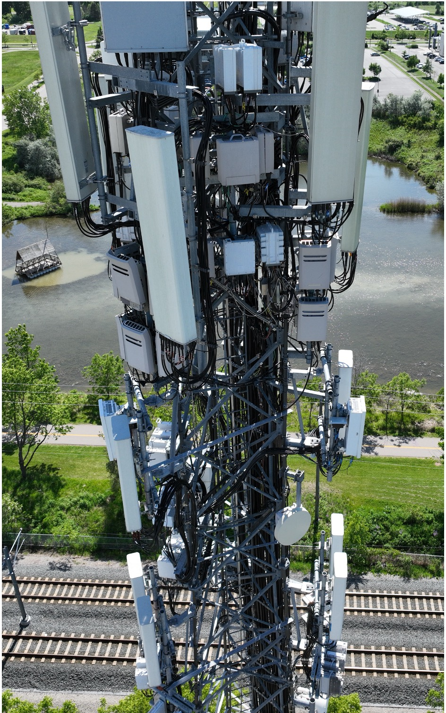
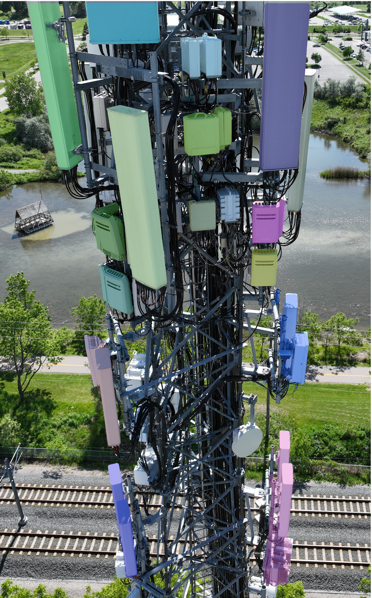
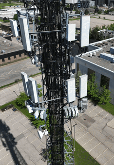

<div align="center">
<h2>SDG-SAM: Salient-Depth-Grounded SAM for Robust Cell Tower Component Segmentation</h2>
</div>

SDG-SAM is a **zero-shot instance segmentation pipeline** designed for fine-grained segmentation of communication tower components—antennas, and radios—in **real-world UAV imagery**. The system integrates **saliency**, **monocular depth**, **open-vocabulary detection**, and **foundation-model segmentation** into a unified workflow tailored for complex outdoor inspection environments.


## Overview

UAV imagery of cell towers presents challenges such as strong background clutter, occlusions, viewpoint variation, and visually similar metallic structures. Traditional detectors and vanilla SAM often misidentify background objects or miss small components. **SDG-SAM builds on the Grounded-SAM paradigm and introduces multi-modal filtering steps** to make segmentation more robust and reliable for inspection tasks.

The pipeline combines:

- **Saliency-based foreground extraction**  
  Using [Transparent Background](https://github.com/plemeri/transparent-background) to suppress irrelevant background objects.
- **Monocular depth estimation**  
  Using [Depth Anything](https://github.com/LiheYoung/Depth-Anything) to recover missing foreground pixels and isolate tower components based on depth cues.
- **Open-vocabulary detection**  
  Using [Grounding DINO](https://github.com/IDEA-Research/GroundingDINO) to localize antennas and radios via text prompts.
- **High-quality component segmentation**  
  Using [Segment Anything (SAM)](https://github.com/facebookresearch/segment-anything) to produce refined instance-level masks.

This multi-stage workflow significantly reduces false positives and improves segmentation completeness under heavy clutter and occlusion.


## Key Features


- **Zero-shot segmentation** — No training required; works across diverse tower types.  
- **Fine-grained detection** — Segments individual antennas, radios, and mounted components.  
- **Multi-modal fusion** — Integrates appearance (saliency), geometry (depth), and text grounding.  
- **Robust in complex scenes** — Handles clutter, occlusions, and challenging lighting.  


## Architecture

The pipeline begins with **saliency-based object detection** to isolate foreground elements from the background, suppressing irrelevant scene content. A **depth map** is then used to recover any missed foreground details, exploiting the geometric cue that the tower is closer to the camera than background objects. Next, **Grounding DINO** generates bounding boxes around targeted components within the refined foreground mask, using text prompts to localize antennas and radios. Post-processing refines these bounding boxes to eliminate false positives and overlapping detections. Finally, **SAM** generates high-quality 2D instance-level masks for each component using the refined bounding boxes as prompts.

<p align="center">
  
</p>


## Sample Outputs

<table align="center">
  <tr>
    <td align="center"><b>Input Image</b></td>
    <td align="center"><b>Final Segmentation</b></td>
    <td align="center"><b>Results on Several Images</b></td>
  </tr>
  <tr>
    <td align="center"></td>
    <td align="center"></td>
    <td align="center"></td>
  </tr>
</table>


## Installation

### Prerequisites

- Python 3.8
- CUDA 11.8 (for GPU version) or CPU

### Setup

1. **Clone the repository**:
   ```bash
   git clone git@github.com:lesani-ali/Cell-Tower-Segmentation.git
   cd Cell-Tower-Segmentation
   ```

2. **Create conda environment**:
   ```bash
   conda create --name sdg_sam python=3.8
   conda activate sdg_sam
   ```

3. **Install the package**:

   **For GPU (CUDA 11.8)**:
   ```bash
   bash ./scripts/install_packages.sh
   ```

   **For CPU-only**:
   ```bash
   bash ./scripts/install_packages.sh --cpu
   ```

   This script installs:
   - Main package ([src/seg_cell_tower](src/seg_cell_tower))
   - Depth Anything ([src/seg_cell_tower/third_party_models/Depth-Anything](src/seg_cell_tower/third_party_models/Depth-Anything))
   - Grounding DINO ([src/seg_cell_tower/third_party_models/GroundingDINO](src/seg_cell_tower/third_party_models/GroundingDINO))

4. **Download model checkpoints**:

   Download the following pretrained models and place them in the [`ckpts/`](ckpts/) directory:

   - **Grounding DINO**: [`groundingdino_swint_ogc.pth`](https://github.com/IDEA-Research/GroundingDINO/releases/download/v0.1.0-alpha/groundingdino_swint_ogc.pth)
   - **SAM**: [`sam_vit_h_4b8939.pth`](https://dl.fbaipublicfiles.com/segment_anything/sam_vit_h_4b8939.pth)

   ```bash
   # Example download commands
   cd ckpts/

   wget -nc -q https://github.com/IDEA-Research/GroundingDINO/releases/download/v0.1.0-alpha/groundingdino_swint_ogc.pth

   wget -nc -q https://dl.fbaipublicfiles.com/segment_anything/sam_vit_h_4b8939.pth

   cd ..
   ```

## Usage

### Command Line Interface

Run the segmentation pipeline on a directory of images:

```bash
segct \
    --config-dir ./config/config.yaml \
    --input-img-dir ./data/input_images \
    --output-img-dir ./data/output_images \
    --output-mask-dir ./data/output_masks
```

**Arguments**:
- `--config-dir`: Path to configuration file (default: `./config/config.yaml`)
- `--input-img-dir`: Directory containing input images (default: `./data/input_images`)
- `--output-img-dir`: Directory to save visualization images (default: `./data/output_images`)
- `--output-mask-dir`: Directory to save segmentation masks (default: `./data/output_masks`)

### Python API

```python
from seg_cell_tower.pipeline.pipeline import SegmentationPipeline
from seg_cell_tower.utils.config import load_config
from seg_cell_tower.utils.io import load_image

# Load configuration
config = load_config('./config/config.yaml')

# Initialize pipeline
pipeline = SegmentationPipeline(config)

# Run inference on single image
image = load_image('./data/input_images/tower.jpg')
masks = pipeline.predict(image)

# Or process entire directory
pipeline.process_directory(
    input_img_dir='./data/input_images',
    output_img_dir='./data/output_images',
    output_mask_dir='./data/output_masks'
)
```

## Configuration

Edit [`config/config.yaml`](config/config.yaml) to customize model settings:

```yaml
models:
  saliency:
    mode: "base"
    device: "cuda:0"
  depth: 
    ckpt: "LiheYoung/depth_anything_vitl14"
    device: "cuda:0"
  object_detection:
    ckpt: "./ckpts/groundingdino_swint_ogc.pth"
    config_path: "./src/seg_cell_tower/third_party_models/GroundingDINO/groundingdino/config/GroundingDINO_SwinT_OGC.py"
    text_prompt: "small bright rectangles attached to tower"
    box_threshold: 0.14
    text_threshold: 0.25
    device: "cuda:0"
  segmentation:
    ckpt: "./ckpts/sam_vit_h_4b8939.pth"
    model_type: "vit_h"
    device: "cuda:0"

# Depth thresholds for foreground recovery and background filtering
recover_info_threshold: 140
ignore_info_threshold: 80
```

**Key parameters**:
- `text_prompt`: Description for Grounding DINO to detect components
- `box_threshold`: Confidence threshold for bounding box predictions
- `text_threshold`: Confidence threshold for text-image matching
- `recover_info_threshold`: Depth value above which pixels are recovered to foreground
- `ignore_info_threshold`: Depth value below which objects are filtered as too far

## Acknowledgments

This project builds upon excellent work from:
- [Grounded-SAM](https://github.com/IDEA-Research/Grounded-Segment-Anything)
- [Grounding DINO](https://github.com/IDEA-Research/GroundingDINO)
- [Segment Anything (SAM)](https://github.com/facebookresearch/segment-anything)
- [Depth Anything](https://github.com/LiheYoung/Depth-Anything)
- [Transparent Background](https://github.com/plemeri/transparent-background)

## Citation

If you use SDG-SAM in your research, please cite:

```bibtex
@misc{sdg-sam2025,
    author = {Lesani, Ali and Yeum, Chul Min},
    title = {SDG-SAM: Salient-Depth-Grounded SAM for Robust Cell Tower Component Segmentation},
    year = {2025},
    url = {https://github.com/lesani-ali/Cell-Tower-Segmentation}
}
```

